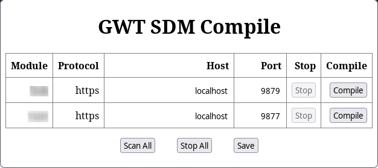

# GWT SDM Compile

This extension replaces the following bookmarklets:

* Dev Mode On
* Compile
* Dev Mode Off

It works in Firefox and Chrome and it is Manifest V3 based.

The extension scans for all GWT modules in all frames (main window and
iframes). In firefox you need to click in the scanAll button to request
an extra permission in order to work for iframes with different origins.

The extension provides some rudimetary support to save the configuration so
it can be reused for the specific module/protocol combination. This is
useful when you have multiple GWT modules or HTTPS setups as described here
https://vasvir.wordpress.com/2017/02/07/gwt-super-dev-mode-https-setup-in-7-steps/

## Disclaimer

The extension is for GWT users, which are developers, and which should know
what they are doing. Obviously if you use extensions like this that injects
scripts left and right you may open your self some new security holes. If you
have any doubts please review the source code (~ 250 LOC) and decide for your
self.

## How to run it

There are no plans yet to release this extension officially. Since it
addresses developers and not the generally public this is not required.
A developer can easily clone it from GitHub and install it directly from
the cloned directory. There are many resources in the web on how to do this
for both Firefox and Chrome.

## How it works

The extensions is somewhat complex due to the restrictions imposed by
browser makers. It is not allowed for the content script to access the
page's variables. So the content script has to inject a script to access
these variables. The extension communicates with the content script with
messages. The content script communicates with the page with messages. All
communication are async of course. So there is this weird trampoline:

extension (popup) --- content script --- page (injected script)

The final act of the page injected script is to inject dev_mode.js which
handles the actual compilation exactly as it was with the bookmarklets.

## Known Issues

### Protection hurdles

With the advent of Content Security Policies (CSP) and the automatic blocking
of third party cookies some pages refuse to compile the GWT modules in them.
I haven't encounter a CSP problem yet but I have been bitten by the 3rd party
cookie protection when dev_mode.js was trying to access sessionStorage. To
spice things up, this is not happening in all pages of course.

So to sum it up, injecting dev_mode.js won't fly for long. What needs to be
done to workaround that is port the dev_mode.js to this extension. The
extension has all the access it requires even if it has to go the trampoline
hoops described above.

The problem is that dev_mode.js is served by the GWT codeserver and that
means it is changed in lockstep with the codeserver as it is the only client
of it. It won't be fun to incorporate the current dev_mode.js just to have a
new incompatible one released the next day.

So for now if you encounter problems with the compilation try to

* disable 3rd party cookie protection
* use some other extension to modify CSP
